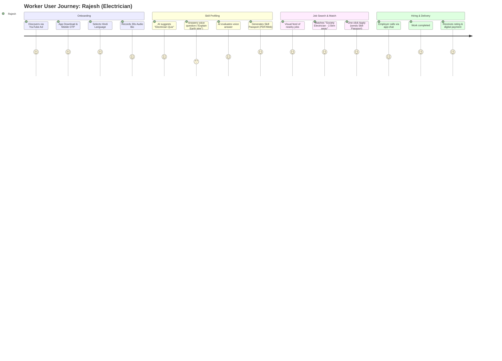

# SkillVerse: Phase 1 - Product Requirement Document & Market Analysis

## 1. Executive Summary & Value Proposition

SkillVerse is an AI-powered, vernacular-first micro-job and upskilling platform designed specifically for India’s semi-skilled and blue/grey-collar workforce. By leveraging native voice-based AI assessment, regional language micro-learning, and localized job matching, SkillVerse bridges the trust gap between employers and the unorganized workforce.

### The Problem
*   **The Resume Barrier:** 90% of semi-skilled workers do not have a professional resume. Standard digital job platforms require text-heavy inputs, creating onboarding drop-offs.
*   **Vernacular Gap:** Existing professional networks (like LinkedIn) and job portals are English-centric, leaving out ~90% of non-English fluent workers.
*   **Trust & Verification Deficit:** Employers struggle with skill verification, relying on word-of-mouth or face-to-face trials. Resume fraud and exaggerated skills are common.
*   **The Skills Loop:** Workers do not know *what* skills will increase their income, nor do they have access to bite-sized, regional learning modules.

### The SkillVerse Solution
*   **Digital Skill Passport:** A dynamic, mobile-optimized visual portfolio. It contains verified skills, voice/video intros, work history, ratings, and a trust score.
*   **AI Vernacular Voice Assessment:** Workers complete oral assessments in regional languages (Hindi, Kannada, Tamil, etc.). SkillVerse's speech-to-text and NLP models grade their technical domain knowledge.
*   **Vernacular Micro-learning:** Contextual, bite-sized visual lessons tied to high-demand local jobs, generating automated micro-certifications.
*   **Geospatial Job Matching:** Real-time, distance-optimized matching algorithm linking workers to micro-jobs, gig work, or contract roles within a 5-10km radius.

---

## 2. Market Analysis

### Market Size & TAM (Total Addressable Market)
*   **TAM (India's Blue/Grey Collar Workforce):** ~450 Million workers (including construction, logistics, retail, domestic, and repair services).
*   **SAM (Serviceable Addressable Market):** ~150 Million internet-active workers in Tier-1, Tier-2, and Tier-3 cities owning smartphones with regional data access.
*   **SOM (Serviceable Obtainable Market):** ~15 Million workers within 3 years, targeting high-density logistics, facilities management, retail, and domestic work hubs in fast-growing states.

### Key Drivers
1.  **High Smartphone Penetration:** Affordable 4G/5G data coverage in Tier-2/3 towns and urban slums.
2.  **UPI & FinTech Adoption:** Workers are highly comfortable with digital transactions (GPay, PhonePe, Paytm).
3.  **Formalization of the Gig Economy:** E-commerce, quick-commerce, and logistics giants (Zomato, Blinkit, Zepto, Amazon, Urban Company) have normalized on-demand, contract-based hiring.

### Competitor Matrix

| Competitor | Target Segment | Skill Verification | Primary UI Mode | Vernacular Coverage |
| :--- | :--- | :--- | :--- | :--- |
| **Apna** | Entry-level white/grey-collar | None / Self-declared | Text-based forms | Moderate |
| **WorkIndia** | Low-skilled/blue-collar | None | Text-based forms | High |
| **Urban Company** | Managed gig workers | Strict offline trials | Managed marketplace | English / Hindi |
| **SkillVerse (Ours)** | **Semi-skilled / Grey-collar** | **AI Voice & Micro-certs** | **Voice-first & Visual** | **Multi-lingual Native** |

---

## 3. User Personas

### Persona 1: Rajesh Kumar - The Semi-Skilled Electrician
*   **Demographics:** 28 years old, lives in a Tier-2 city (Kanpur), migrated to Noida. Speaks Hindi and basic English terms (e.g., "inverter", "fuse").
*   **Behavioral Traits:** Uses YouTube for troubleshooting, UPI for payments, and WhatsApp/Instagram. Struggles to write in English.
*   **Pain Points:** 
    *   No formal resume; gets jobs through contractors who take a 30% cut.
    *   Employers doubt his ability to install modern smart switches and inverter batteries.
*   **SkillVerse Solution:** Rajesh does a 3-minute oral Hindi assessment on inverter installation on SkillVerse. The AI scores his technical explanation and issues a "Verified Inverter Expert" badge on his Skill Passport.

### Persona 2: Sunita Gowda - The Housekeeping Professional
*   **Demographics:** 22 years old, migrated from a village near Mandya to Bangalore. Speaks Kannada and understands basic Hindi.
*   **Behavioral Traits:** Highly motivated to earn. Very conscious of safety. Wants to work in premium apartment societies or hotels.
*   **Pain Points:**
    *   Has zero digital footprint.
    *   Doesn't know how to present herself professionally to high-paying household managers.
    *   Lacks formal training in handling premium chemicals or automated cleaning equipment.
*   **SkillVerse Solution:** Sunita completes visual micro-lessons on "Five-Star Cleaning Protocols" in Kannada. She receives an automatic digital certificate and a QR code passport she can share on WhatsApp.

### Persona 3: Vikram Shah - The Small Enterprise Employer
*   **Demographics:** 38 years old, operates a boutique facility management agency in Pune (50+ clients).
*   **Behavioral Traits:** Relies heavily on speed. If a client requests a plumber at 9 AM, he needs one by 11 AM.
*   **Pain Points:**
    *   50% worker churn rate.
    *   Takes days to verify credentials; sends workers to sites who perform poorly, damaging his agency's reputation.
*   **SkillVerse Solution:** Vikram uses the SkillVerse Employer Dashboard, searches for "Verified Plumbers" near Pune-Kothrud, listens to their 30-second audio introductions, and hires them instantly with standard contracts.

---

## 4. User Journey Maps

---

## 5. Functional Requirements (PRD)

### 5.1 Onboarding & Authentication
*   **Req-1.1:** Mobile OTP-based authentication (using SMS/WhatsApp gateways like Twilio/Msg91) to match regional behaviors. No passwords.
*   **Req-1.2:** Unified login flow; users choose "Worker" or "Employer" role immediately after OTP validation.
*   **Req-1.3:** Single-button language switcher persisted across the frontend and backend user contexts.

### 5.2 Skill Passport
*   **Req-2.1:** A public-facing unique URL (e.g., `skillverse.in/passport/rajesh-102`) serving as a dynamic resume.
*   **Req-2.2:** Auto-generated PDF download of the passport, heavily visual (icons, badges, stars) with a scannable QR code.
*   **Req-2.3:** Section for "Verified Audits" where users' oral assessment scores and micro-learning achievements are listed.

### 5.3 AI Vernacular Voice Assessment
*   **Req-3.1:** Audio recording component in the mobile app (supporting compression for low-bandwidth scenarios, e.g., WebM or AAC).
*   **Req-3.2:** Integrates with speech-to-text (STT) processors (e.g., Whisper API) customized for regional accents and mixed-language (Hinglish, Kanglish) terms.
*   **Req-3.3:** NLP Analyzer scores technical accuracy based on industry-standard prompt-rubrics (analyzing keywords like "phase", "neutral", "insulation").
*   **Req-3.4:** Return structured metrics: fluency, domain accuracy, key concept identification, and overall rank.

### 5.4 Micro Learning
*   **Req-4.1:** Core course layout consisting of short-form vertical videos (like YouTube Shorts or TikTok) mapped to trade guidelines.
*   **Req-4.2:** In-video checkpoints (interactive visual quizzes) to prevent skip-and-earn exploits.
*   **Req-4.3:** Auto-issue of micro-credentials on 100% video completion and passing quiz marks (>80%).

### 5.5 Local Job Marketplace
*   **Req-5.1:** Geospatial index (MongoDB `$nearSphere` or PostgreSQL PostGIS) to find jobs based on current GPS location.
*   **Req-5.2:** Job categories with sub-specialties (e.g., Plumber -> Clogged drain specialist, Pipefitter).
*   **Req-5.3:** "Quick Apply" sending the worker's Skill Passport direct to the employer's applicant tracking dashboard.

### 5.6 Real-Time Communication
*   **Req-6.1:** Double-blind text chat and voice notes exchange via Socket.io to prevent direct phone leakage before application approval.
*   **Req-6.2:** Instant push notifications (Firebase Cloud Messaging) for application updates (Applied, Shortlisted, Hired, Rejected).

---

## 6. Non-Functional & Scalability Requirements (10M Target)

1.  **Latency SLA:** Voice evaluation must complete asynchronously within 30 seconds of file submission. UI should display immediate processing animations to reduce perceived latency.
2.  **Data Isolation & Compliance:** Highly structured data storage adhering to the India DPDP (Digital Personal Data Protection) Act, enforcing consent-based sharing of worker profiles.
3.  **Low-Bandwidth Resilience:** Frontend assets must be optimized (gzip/brotli, SVG icons, lazy-loaded visual blocks). The mobile PWA/React client must work gracefully on 2G/3G speeds.
4.  **Security & Rate Limiting:** Prevent API scraping of worker profiles. Impose strict rate-limits on OTP requests and Job application submissions to prevent spam.
5.  **Multi-Tenant Architecture:** Built from day one to support "Enterprise Accounts" where large agencies can manage sub-contractors, assign jobs, and view custom team compliance reports.
