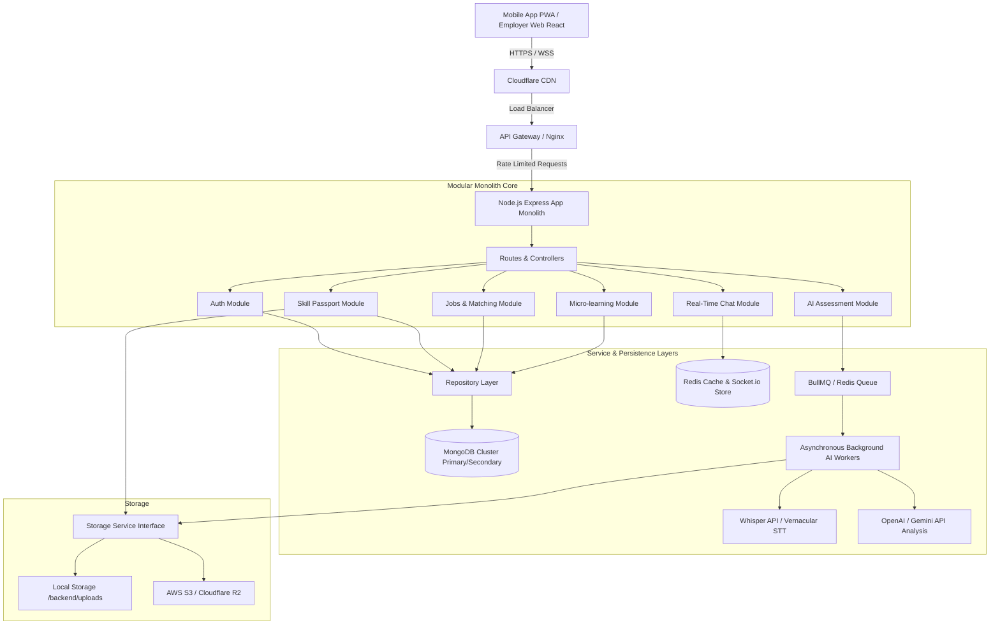
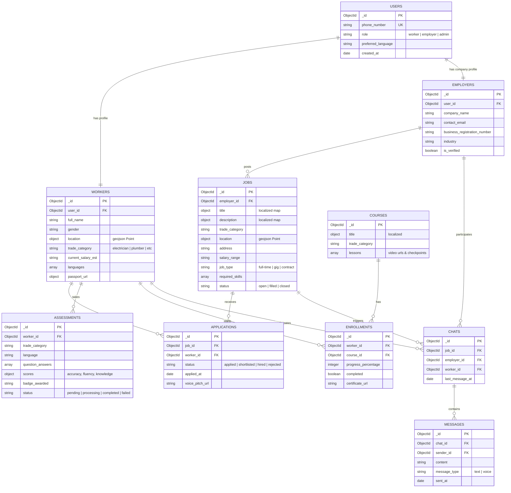

# SkillVerse: Phase 2 - System Architecture & Database Design

This document details the software architecture, database design, API specification, and directory layout for **SkillVerse**. The design emphasizes high scale (10 million+ workers), clean separation of concerns, and resilient asynchronous processing.

---

## 1. Complete System Architecture

To balance startup speed with enterprise scalability, we adopt a **Modular Monolith with Clean Architecture**. This allows a single deployment unit initially, but with clean domain boundaries so modules (like Voice Assessment or Job Matching) can be split into microservices without rewriting code.

### High-Level Architecture Diagram



### Scale & Architecture Decisions
1.  **Asynchronous Voice Assessment Queue:** Processing audio, sending it to Speech-to-Text (STT) services, and running LLM checks takes 5-15 seconds. If run synchronously on the main thread, it will exhaust Node.js connections. We offload audio processing to **BullMQ (Redis-backed queue)**. The client uploads the file to the active Storage Service, triggers the API, gets a `202 Accepted` response with an execution ID, and polls or receives a Socket.io event when complete.
2.  **Geospatial Scalability:** Job listings are searched based on worker location. We use MongoDB's **2dsphere index** on coordinates `[longitude, latitude]`. For extreme scales, we can move this to Redis Geospatial or ElastiSearch.
3.  **Real-Time Messaging with Redis adapter:** Socket.io utilizes a Redis adapter. This ensures that if we scale to multiple instances of the Node.js API server, socket events are successfully broadcast across servers.
4.  **Storage Provider Abstraction (Strategy Pattern):** To support lightweight local development on macOS (M2 ARM64) without requiring active cloud credentials, we implement a `StorageService` interface. The system reads `STORAGE_PROVIDER=local` from `.env`, activating a filesystem storage provider that saves media (voice profiles, learning certs) to a local folder `/backend/uploads`. In production, flipping to `STORAGE_PROVIDER=s3` loads the AWS SDK provider without touching any application-level business logic.


---

## 2. Database Design & ER Diagram

We utilize **MongoDB** because of its document flexibility (handling varying schema requirements for different trades like Plumbing vs. Electrical) and native geospatial query capabilities.

### Entity-Relationship Diagram



---

## 3. API Specifications (RESTful v1)

All endpoints are versioned under `/api/v1`. Headers must include authorization `Bearer <JWT_ACCESS_TOKEN>`.

### 3.1 Authentication
*   `POST /api/v1/auth/request-otp`
    *   *Body:* `{ "phoneNumber": "+919876543210" }`
    *   *Response:* `{ "success": true, "message": "OTP sent successfully" }`
*   `POST /api/v1/auth/verify-otp`
    *   *Body:* `{ "phoneNumber": "+919876543210", "code": "123456" }`
    *   *Response:* `{ "accessToken": "jwt...", "refreshToken": "jwt...", "user": { "id": "...", "role": "worker" } }`
*   `POST /api/v1/auth/refresh`
    *   *Body:* `{ "refreshToken": "jwt..." }`
    *   *Response:* `{ "accessToken": "jwt..." }`

### 3.2 Worker Profile & Passport
*   `GET /api/v1/workers/me` - Fetch own profile details.
*   `PUT /api/v1/workers/me` - Update location, trade category, languages, and name.
*   `GET /api/v1/workers/:id/passport` - Generate/view public Skill Passport.
*   `GET /api/v1/workers/me/passport/pdf` - Initiate generation and download of visual PDF passport.

### 3.3 Job Board
*   `POST /api/v1/jobs` (Employer only) - Create a job posting.
*   `GET /api/v1/jobs/nearby`
    *   *Query Parameters:* `lat`, `lng`, `radiusKm`, `category`, `limit`, `page`
    *   *Response:* Paginated list of jobs sorted by geographical proximity.
*   `POST /api/v1/jobs/:id/apply`
    *   *Body:* `{ "voicePitchS3Key": "optional-audio-intro" }`
    *   *Response:* `{ "applicationId": "...", "status": "applied" }`

### 3.4 Voice & AI Assessment
*   `GET /api/v1/assessments/start` - Fetch an assessment flow containing voice questions.
*   `POST /api/v1/assessments/submit`
    *   *Body:* `{ "tradeCategory": "electrician", "audioAnswers": [{ "questionId": "123", "s3Key": "audio/path.webm" }] }`
    *   *Response:* `{ "assessmentId": "...", "status": "processing" }`
*   `GET /api/v1/assessments/:id/status` - Poll assessment score and feedback metrics.

---

## 4. Engineering Folder Structure

We follow Clean Architecture directory patterns (adapted for Node.js + TypeScript). 

```text
skillverse/
├── src/
│   ├── config/             # DB connection, Env vars, AWS configuration
│   ├── core/               # Shared constants, interfaces, custom errors
│   │   ├── errors/
│   │   └── utils/
│   ├── modules/            # Domain Modules (Separated Domain Logic)
│   │   ├── auth/
│   │   ├── worker/
│   │   ├── assessment/
│   │   ├── job/
│   │   ├── learning/
│   │   └── chat/
│   │       ├── entities/    # Enterprise Domain Entities (Business Rules)
│   │       ├── repositories/# Interfaces and DB implementations (Repository Pattern)
│   │       ├── services/    # Use Case Logic / Application Services
│   │       ├── controllers/ # HTTP Route Handlers
│   │       └── routes/      # Express Endpoint Definitions
│   ├── shared/             # Middlewares (auth, rateLimit, error, validation)
│   │   ├── middlewares/
│   │   └── validation/
│   ├── app.ts              # Express App setup
│   └── server.ts           # Server runner (HTTP + WebSocket)
├── tests/                  # Integration & Unit Tests
├── docs/                   # Architectural & System documentation
├── Dockerfile
├── docker-compose.yml
├── package.json
└── tsconfig.json
```

### Dependency Flow Rules
*   **Controllers** depend ONLY on **Services**.
*   **Services** implement use-cases and depend on **Repositories** (via Interfaces) to query the database.
*   **Repositories** implement the actual database queries (MongoDB/Mongoose models).
*   This ensures that the core domain (Entities & Services) has **zero** dependency on Mongoose, Express, or any external framework. We can swap Express for Fastify or MongoDB for PostgreSQL with zero edits to the core business logic.
